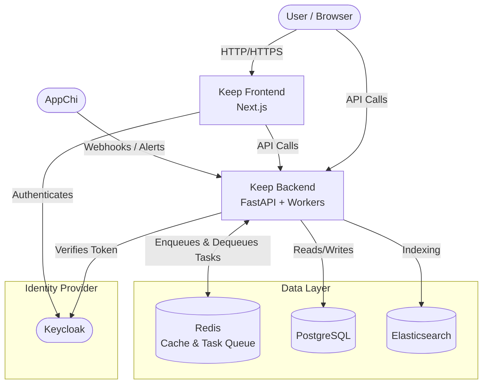
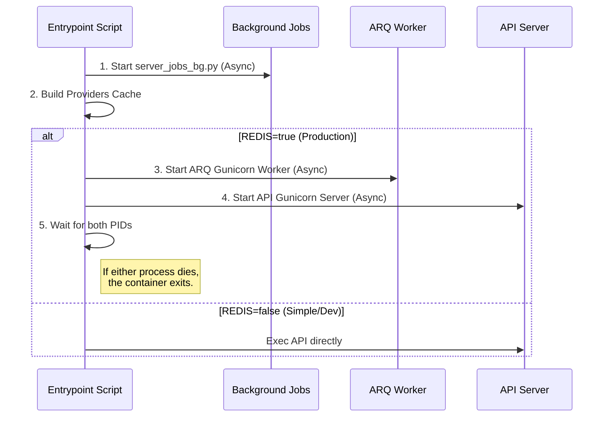

Keep runs as a set of Docker containers orchestrated via Docker Compose (or Kubernetes in production).

## High-Level Architecture Diagram

## Backend Internal Architecture
 
 The `keep-backend` service involves a specific design to handle both API requests and background tasks efficiently within a containerized environment (see [Deployment](/deployment)).
 
 For a detailed look at how data moves through this architecture, see [Data Flow](/data-flow).

### Single Container Design
Keep uses a single Docker image for the backend to simplify deployment. The `entrypoint.sh` script controls the startup process:

1.  **Environment Check**: Determines if `Redis` is enabled.
2.  **Process spawning**:
    *   **API**: Runs `gunicorn` with `uvicorn` workers to serve the FastAPI application (Port 8080).
    *   **Workers**: Runs separate `gunicorn` workers with a custom `ARQGunicornWorker` class to query Redis and execute background tasks (Port 8001).
3.  **Orchestration**: Both processes run simultaneously. If one fails, the container exits to trigger a restart.

**File Reference**: `keep/entrypoint.sh`

### Startup Sequence Diagram (`entrypoint.sh`)

### Redis & ARQ
We use **ARQ**, a lightweight library for asynchronous jobs on Redis.
*   **Producer**: The API pushes jobs (e.g., `process_event_in_worker`) to Redis queues (e.g., `keep_arq_queue_basic`).
*   **Consumer**: The worker processes (running `ARQGunicornWorker`) poll Redis, dequeue jobs, and execute functions like `process_event`.

**File Reference**: `keep/api/arq_worker.py`

