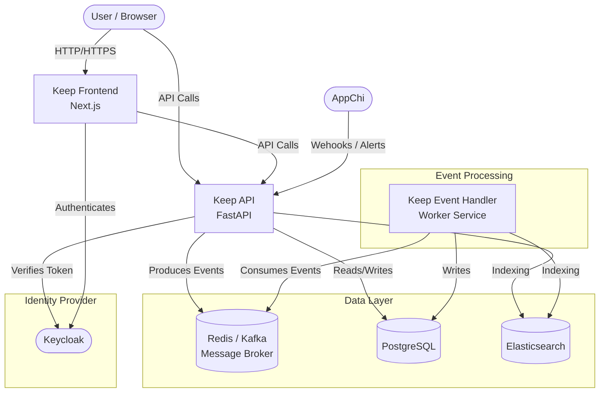

Keep runs as a set of Docker containers orchestrated via Docker Compose (or Kubernetes in production). The architecture is designed to be modular, allowing for a split between the ingestion layer (API) and the processing layer (Event Handler).

## High-Level Architecture Diagram

```mermaid
flowchart TD
    User([User / Browser]) -->|HTTP/HTTPS| Frontend[Keep Frontend 
     Next.js]
    User -->|API Calls| Backend
    Frontend -->|API Calls| Backend[Keep API 
     FastAPI]
    
    subgraph "Data Layer"
        MessageBroker[(Redis / Kafka
         Message Broker)]
        DB[(PostgreSQL)]
        Elastic[(Elasticsearch)]
    end
    
    subgraph "Event Processing"
        EventHandler[Keep Event Handler 
         Worker Service]
    end

    subgraph "Identity Provider"
        Keycloak([Keycloak])
    end

    Prometheus([AppChi]) -->|Wehooks / Alerts| Backend
    Backend -->|Reads/Writes| DB
    Backend -->|Indexing| Elastic
    Backend -->|Produces Events| MessageBroker
    
    EventHandler -->|Consumes Events| MessageBroker
    EventHandler -->|Writes| DB
    EventHandler -->|Indexing| Elastic

    Backend -->|Verifies Token| Keycloak
    Frontend -->|Authenticates| Keycloak
```

## Backend Internal Architecture

The backend logic is split into two primary services to ensure scalability and resilience.

### 1. Keep API (Ingestion)
The API service (`keep-api`) is responsible for handling HTTP requests, authentication, and simple management tasks.
*   **Role**: Serves the Frontend and accepts incoming events (webhooks).
*   **Design**: Stateless FastAPI application.
*   **Event Handling**: Acts as a "dumb pipe" for alerts—validating them and offloading them to the Messaging Layer immediately. It does not perform heavy processing.

### 2. Keep Event Handler (Processing)
The Event Handler (`keep-event-handler`) is a dedicated worker service that processes alerts asynchronously.
*   **Role**: Consumes raw events, runs logic, and persists data.
*   **Capabilities**:
    *   **Parsing**: Converts vendor-specific payloads to standard `AlertDto`.
    *   **Enrichment**: Applies topology and mapping rules.
    *   **Deduplication**: Handles alert correlation and update logic.
    *   **Workflows**: Triggers automation workflows.

### Messaging Layer (Abstraction)
Keep uses an `EventProducer` / `EventConsumer` abstraction to support different messaging backends based on your scale:
*   **Redis (Default)**: Uses ARQ for simple, lightweight queueing. Ideal for small-to-medium deployments.
*   **Kafka**: Supports high-throughput event streaming. Ideal for large-scale enterprise deployments.

### Startup & Deployment
In a typical Docker Compose setup, these services run as separate containers but share the same codebase (monorepo).

**File Reference**: `keep/api/` and `keep/event_handler/`
