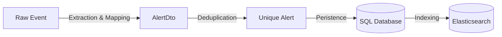

The **Alert Manager** is the backbone of the platform. It is responsible for the entire lifecycle of an alert after it has been ingested, from deduplication to complex querying via the API.

## The Alert Lifecycle

An alert goes through several transformations before it lands in your dashboard.



### 1. From Raw to Normalized
*   **Raw Event**: The JSON payload exactly as sent by the provider (Prometheus, Datadog, etc.).
*   **Extraction**: Keep runs Regex Extraction Rules (handled by `ProvidersFactory`) to pull custom fields from the raw payload if needed.
*   **Mapping**: The specific Provider class (e.g., `PrometheusProvider`) maps the raw fields to the standardized `AlertDto`.

### 2. Deduplication Strategy (`alert_deduplicator.py`)

Once normalized, the alert is passed to the `AlertDeduplicator`. This is critical to prevent database bloat and noise.

#### The Fingerprint
Every alert has a `fingerprint`. This is usually provided by the source (e.g., Prometheus `fingerprint` field) or calculated by the provider. It uniquely identifies the *entity* that is alerting (e.g., "CPU High on Server A").

#### The Content Hash (Deduplication)
Keep calculates a **SHA256 hash** of the alert's content to determine if it has changed.

1.  **Normalization**: The `AlertDto` is converted to a dictionary.
2.  **Field Removal**: Configured `ignore_fields` (like `lastReceived`) are removed. These fields change on every heartbeat but don't represent a *change in state*.
3.  **Hashing**: `hash = sha256(json_dumps(alert_content))`

```python
# Simplified Logic in AlertDeduplicator._apply_deduplication_rule
alert_copy = copy.deepcopy(alert)
for field in rule.ignore_fields:
    alert_copy = self._remove_field(field, alert_copy)

alert_hash = hashlib.sha256(
    json.dumps(alert_copy.dict(), default=str, sort_keys=True).encode()
).hexdigest()
```

#### Duplicate Types
*   **Full Duplicate (`isFullDuplicate`)**: The `fingerprint` AND the `content_hash` match the last alert in the DB.
    *   *Action*: Update `lastReceived`, increment `firingCounter`.
*   **Partial Duplicate (`isPartialDuplicate`)**: The `fingerprint` matches, but the `content_hash` is different (e.g., severity changed from `warning` to `critical`).
    *   *Action*: Treated as a state change. A new history record is often created.

## Querying Alerts (`alerts.py`)

The most complex part of the Alert Manager is how it handles rich queries from the frontend.
The logic resides primarily in `keep/api/core/alerts.py`.

### API Layer
The frontend calls `POST /query` with a `QueryDto`.
*   `cel`: The filter string (e.g., `source == "sentry"`).
*   `limit`, `offset`: For pagination.

### CEL to SQL Conversion
Keep allows users to query alerts using **CEL (Common Expression Language)**.
The backend must translate this into a valid **SQLAlchemy** query.

#### The `FieldMappingConfiguration`
We define a mapping configuration that tells the translator how to treat each field:

```python keep/api/core/alerts.py
    FieldMappingConfiguration(
        map_from_pattern="source",
        map_to="alert.provider_type",  # Maps 'source' in CEL to 'provider_type' column in DB
        data_type=DataType.STRING,
    ),
    FieldMappingConfiguration(
        map_from_pattern="severity",
        map_to=[
             # Searching in JSON blobs if not a standard column
            "JSON(alertenrichment.enrichments).*",
            "JSON(alert.event).*",
        ],
        enum_values=["critical", "high", "warning", "info"], # For sorting/comparison
        data_type=DataType.STRING,
    ),
```

#### Example Translation
**User Query:** `source == "grafana" && severity == "critical"`

**Generated SQL (Conceptual):**
```sql
SELECT * FROM alerts 
WHERE 
  provider_type = 'grafana' 
  AND 
  json_extract(event, '$.severity') = 'critical'
```

### Facets (`get_alert_facets`)
Facets are the sidebar filters in the UI. Calculating these efficiently for millions of alerts is non-trivial.

1.  **Static Facets**: `Severity`, `Status`, `Source`. These are predefined in code.
2.  **Dynamic Facets**: To find other filterable fields, `get_alert_potential_facet_fields` queries the `AlertField` table, which tracks unique keys found in alert payloads.

## Code Reference
*   **Endpoints**: `keep/api/routes/alerts.py` (API Layer)
*   **Logic**: `keep/api/core/alerts.py` (Query Building)
*   **Deduplication**: `keep/api/alert_deduplicator/alert_deduplicator.py` (Hashing)
*   **Model**: `keep/api/models/alert.py` (DTO)
