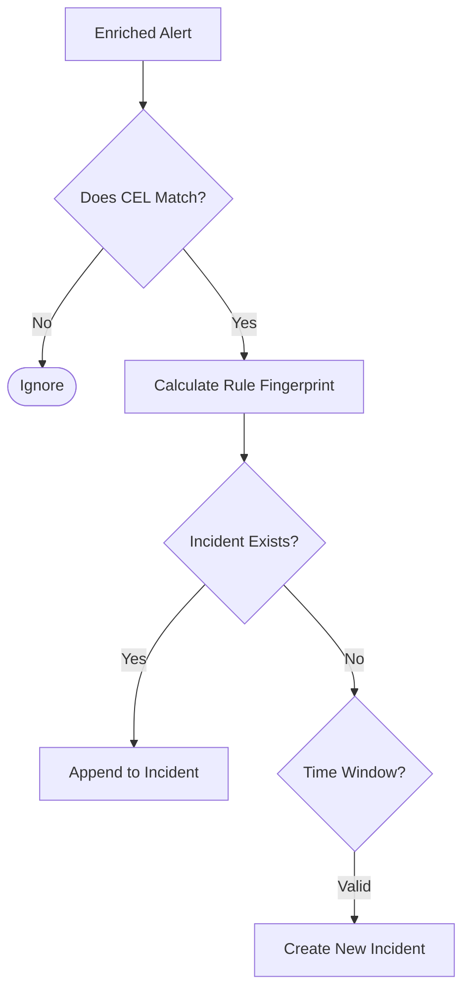

The **Rules Engine** is the intelligence layer that sits above raw alerts. Its primary goal is to **reduce noise** by grouping related alerts into a single **Incident**.

## Concept: Alert vs. Incident

*   **Alert**: A transient notification (e.g., "CPU high on db-1").
*   **Incident**: A persistent, stateful group of alerts that represents a larger problem (e.g., "Database Cluster is down").

## The Grouping Logic (`_calc_rule_fingerprint`)

The core of the Rules Engine is how it decides which alerts belong together. This is determined by the **Correlation Rule**.

### 1. Rule Definition
A rule defines a `grouping_criteria`.
*   Example: `grouping_criteria: ["source", "service"]`

### 2. Fingerprint Calculation
When an alert arrives, the engine extracts the values for these criteria.
*   Alert A: `{ source: "datadog", service: "payment-api", host: "k8s-node-1" }`
*   Alert B: `{ source: "datadog", service: "payment-api", host: "k8s-node-2" }`

Both alerts generate the same **Rule Fingerprint**: `datadog,payment-api`.
Therefore, they are added to the **same Incident**.

## Rule Evaluation Flow (`run_rules`)

### 1. CEL Matching
First, the engine checks if the rule *applies* to this alert using CEL (e.g., `severity == "critical"`).
*   Code Reference: `_check_if_rule_apply`.

### 2. Incident Creation (`_get_or_create_incident`)
If the rule applies, we look for an existing **Firing** incident with the same fingerprint.
*   **Grouping**: We merge the new alert into the existing incident.
*   **Naming**: We update the Incident Name dynamically using the template (e.g., `{{ service }} is down`).

### 3. Multi-Level Rules
A powerful feature is **Multi-level Grouping**. This allows one raw alert to trigger *multiple* incidents if it matches multiple criteria.
*   *Note: Currently, the implementation limits multi-level rules to a single grouping criterion for simplicity.*

## Code Reference
*   **Main Logic**: `keep/rulesengine/rulesengine.py`
    *   `run_rules`: Entry point.
    *   `_calc_rule_fingerprint`: The hashing logic.
    *   `_get_or_create_incident`: State management.
