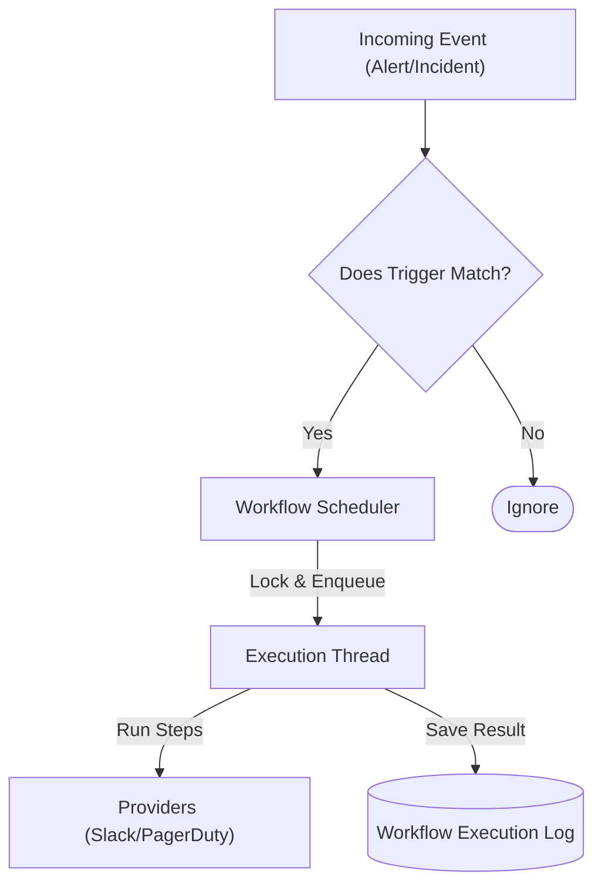

The **Workflow Engine** is responsible for evaluating incoming events against triggers and executing a sequence of actions. It is the core automation component of Keep.

## High-Level Architecture

The engine connects `Triggers` (Events) to `Actions` (Providers) via a `Scheduler`.



## 1. Trigger Matching (`insert_events`)
When an alert arrives, the `WorkflowManager` iterates through **all enabled workflows** for the tenant.

For each workflow, it checks if the trigger condition is met using **CEL (Common Expression Language)**.

### Logic Flow
1.  **Retrieve Workflows**: Fetch all active `workflow.yaml` files from the database.
2.  **Filter/CEL Check**: Evaluate the `on: alert` condition.
    *   Example: `source == "sentry" && severity == "critical"`.
    *   *Note: Legacy filters (`{"key": "source", "value": "sentry"}`) are converted to CEL on the fly via `_convert_filters_to_cel`.*
3.  **Deduplication**: If `only_on_change` is set, it compares the current event with the `previous_alert` to ensure we don't spam for the same state.

```python keep/workflowmanager/workflowmanager.py
# Simplified logic of insert_events
def insert_events(self, tenant_id, events):
    for workflow in all_workflows:
        should_run = self.evaluate_cel(workflow.trigger.cel, event)
        
        if should_run:
             self.scheduler.workflows_to_run.append({
                 "workflow": workflow,
                 "event": event
             })
```

## 2. Execution Context
When a workflow runs, it carries a **Context**. This allows steps to share data.

*   `{{ alert }}`: The alert that triggered the workflow.
*   `{{ steps.step_id.results }}`: The output of a previous step.
*   `{{ env.VAR_NAME }}`: Environment variables (restricted).

### Running Steps
The `Workflow` class executes steps sequentially. If a step fails:
1.  It catches the exception.
2.  It checks for an `on_failure` action in the workflow definition.
3.  It logs the error to the database.

## 3. Safety & Limitations
*   **Premium Providers**: In `MULTI_TENANT` mode, certain providers (like `bash` or `python`) are restricted to prevent abuse (`_check_premium_providers`).
*   **Timeouts**: Workflows have execution time limits to prevent them from hanging the worker.

## Code Reference
*   **Manager**: `keep/workflowmanager/workflowmanager.py` (Orchestration)
*   **Scheduler**: `keep/workflowmanager/workflowscheduler.py` (Queue management)
*   **Execution**: `keep/workflowmanager/workflow.py` (Step logic)
