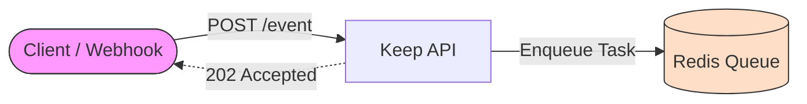
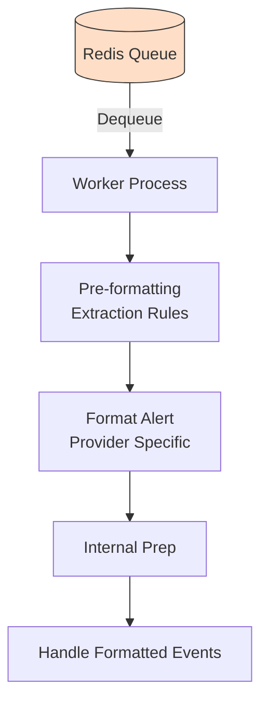
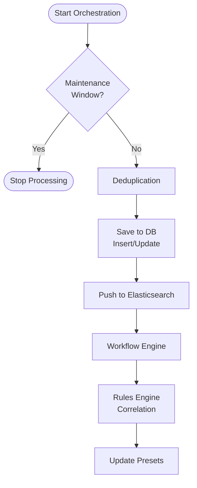
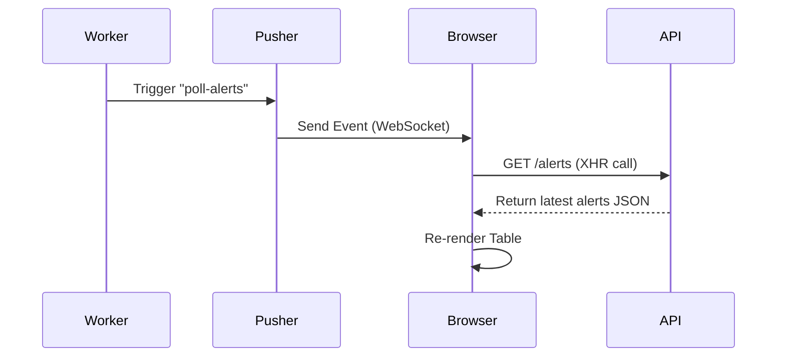

## High-Level Overview

Keep uses an **asynchronous architecture**. The API handles ingestion (fast), while background workers handle the heavy lifting (parsing, deduplication, workflows).

This separation ensures that high volumes of alerts do not block the API or slow down the user interface.

## Part 1: API Layer (Ingestion)

The API layer is responsible **only** for receiving the alert and safely placing it into a queue. It does **not** process, validate, or save the alert to the database.

### Ingestion Flow
1.  **Endpoint**: Client posts to `POST /alerts/event/{provider_type}`.
2.  **Queue**: The API pushes the raw payload to **Redis** (specifically `keep_arq_queue_basic`).
3.  **Response**: Returns `202 Accepted` immediately, confirming receipt.



## Part 2: Worker Layer (Processing)

The Worker layer (running `ARQGunicornWorker`) picks up tasks from Redis and executes the business logic. **This is where the actual "work" happens.**

### Processing Flow
1.  **Dequeue**: Worker pulls the raw event from Redis.
2.  **Normalization**: Converts vendor-specific JSON to `AlertDto`.
3.  **Orchestration**: Runs deduplication, DB persistence, and automation triggers.

> For a detailed explanation of how deduplication, hashing, and SQL querying works, read the [Alert Manager Component](/components/alert-manager) guide.



### Deep Dive: `__handle_formatted_events`

Once the alert is formatted, it enters the orchestration phase:



## Part 3: Real-time UI Updates

Keep uses **Websockets (via Pusher)** to notify the UI when new data is available. This avoids aggressive polling and keeps the interface snappy.

### Update Flow
1.  **Notification**: After the Worker saves the alert, it sends a message to Pusher on a private channel (`private-{tenant_id}`).
    *   Events: `poll-alerts`, `incident-change`, `poll-presets`.
2.  **Reaction**: The Browser receives the text message (with no data payload).
3.  **Fetch**: The Browser calls the API (`GET /alerts`) to fetch the latest state.



## The Alert Model (`AlertDto`)
The `AlertDto` is the normalized schema used inside the Worker.

<ResponseField name="id" type="str">
  Unique identifier (UUID).
</ResponseField>
<ResponseField name="name" type="str">
  Name or title of the alert.
</ResponseField>
<ResponseField name="status" type="AlertStatus">
  Status: `firing`, `resolved`, `acknowledged`, `suppressed`, `pending`, `maintenance`.
</ResponseField>
<ResponseField name="severity" type="AlertSeverity">
  `critical`, `high`, `warning`, `info`, `low`.
</ResponseField>
<ResponseField name="lastReceived" type="str">
  ISO 8601 timestamp of when the alert was last received.
</ResponseField>
<ResponseField name="source" type="list[str]">
  List of sources (e.g., `["prometheus"]`, `["datadog"]`).
</ResponseField>
<ResponseField name="fingerprint" type="str">
  **Crucial**: simple SHA256 signature used for deduplication.
</ResponseField>
<ResponseField name="service" type="str">
  The service impacted by this alert.
</ResponseField>
<ResponseField name="environment" type="str">
  The environment (e.g., `production`, `staging`).
</ResponseField>
<ResponseField name="pushed" type="bool">
  `True` if pushed via webhook, `False` if pulled by Keep.
</ResponseField>
<ResponseField name="labels" type="dict">
  Key-value pairs of extra metadata.
</ResponseField>
<ResponseField name="payload" type="dict">
  The original raw data from the provider (stored mostly for debugging/display).
</ResponseField>
<ResponseField name="firingStartTime" type="str">
  Calculated field: when the alert first started firing.
</ResponseField>
<ResponseField name="firingCounter" type="int">
  How many times this alert has fired continuously.
</ResponseField>

## Deep Dive: Worker Code

The following snippets show exactly how the Worker processes an event.

### 1. The `process_event` Function
This function is the entry point. It calls the **Provider Class** to format the raw data.

#### Step A: Logic Setup
The function initializes tracing (OpenTelemetry) and creates a database session that will persist throughout the lifecycle of this event.

```python keep/api/tasks/process_event_task.py
@processing_time_summary.time()
def process_event(
    ctx: dict,  # arq context
    tenant_id: str,
    provider_type: str | None,
    # ... other args
) -> list[Alert]:
    start_time = time.time()
    job_id = ctx.get("job_id")
    
    tracer = trace.get_tracer(__name__)
    raw_event = copy.deepcopy(event)
    events_in_counter.inc()
    
    # Session creation is omitted for brevity, but it happens here.
    # ...
```

#### Step B: Pre-computation & Provider Formatting
Before we even look at the provider logic, we run **Extraction Rules**. These are regex rules defined by the user to extract fields from the raw payload (e.g., extracting `host` from a `message` string).

Then, we load the specific Provider class (e.g., `PrometheusProvider`) dynamically. This is where the magic happens: the `format_alert` method of the provider knows how to map vendor fields to `AlertDto`.

```python 
        # 1. Extraction Rules
        with tracer.start_as_current_span("process_event_pre_alert_formatting"):
            enrichments_bl = EnrichmentsBl(tenant_id, session)
            event = enrichments_bl.run_extraction_rules(event, pre=True)

        # 2. Dynamic Provider Loading & Formatting
        with tracer.start_as_current_span("process_event_provider_formatting"):
                provider_class = ProvidersFactory.get_provider_class(provider_type)
                
                # Each provider implements format_alert to normalize data
                event = provider_class.format_alert(
                    tenant_id=tenant_id,
                    event=event,
                    provider_id=provider_id,
                    provider_type=provider_type,
                )
```

#### Step C: Preparation & Handoff
Finally, we ensure the event is a list (to support batch processing) and run internal preparation (setting basic defaults like `lastReceived` if missing). Then we hand off to the orchestrator.

```python
        if event:
            if isinstance(event, AlertDto):
                event = [event] # Ensure list format

            with tracer.start_as_current_span("process_event_internal_preparation"):
                __internal_prepartion(event, fingerprint, api_key_name)

            # CRITICAL: Handoff to the Core Logic
            formatted_events = __handle_formatted_events(
                tenant_id,
                provider_type,
                session,
                # ...
            )
            return formatted_events
```

### 2. Orchestration (`__handle_formatted_events`)
This is the "Brain" of the worker. It decides what to do with the valid, formatted alert.

#### Step A: Validations & Deduplication
First, we check if the alert is blocked by a **Maintenance Window**. If so, we drop it immediately.

Then, we run **Deduplication**. The `AlertDeduplicator` checks the alert's `fingerprint` and `hash`.
*   **Full Duplicate**: Same fingerprint, same content. (We only update the timestamp).
*   **Partial Duplicate**: Same fingerprint, different content. (We process it as an update/resolve).

```python keep/api/tasks/process_event_task.py
def __handle_formatted_events(...):
    # 1. Maintenance Windows
    if KEEP_MAINTENANCE_WINDOWS_ENABLED:
        # Check against maintenance rules...
        # ...

    # 2. Deduplication Strategy
    with tracer.start_as_current_span("process_event_deduplication"):
        alert_deduplicator = AlertDeduplicator(tenant_id)
        deduplication_rules = alert_deduplicator.get_deduplication_rules(...)
        
        for event in formatted_events:
            # Sets event.isFullDuplicate boolean
            event = alert_deduplicator.apply_deduplication(event, deduplication_rules, ...)

        # Split: We save ALL events, but logic differs for duplicates
        deduplicated_events = list(filter(lambda event: event.isFullDuplicate, formatted_events))
        formatted_events = list(filter(lambda event: not event.isFullDuplicate, formatted_events))
```

#### Step B: Persistence & Search
We persist the alert to **PostgreSQL**. This handles the `INSERT` or `UPDATE` SQL commands.
If configured, we also push the JSON document to **Elasticsearch** (ECK) for high-performance text search.

```python
    # 3. Persistence (PostgreSQL)
    with tracer.start_as_current_span("process_event_save_to_db"):
        enriched_formatted_events = __save_to_db(
            tenant_id, provider_type, session, raw_events,
            formatted_events, deduplicated_events, ...
        )

    # 4. Search Indexing (Elasticsearch/Opensearch)
    with tracer.start_as_current_span("process_event_push_to_elasticsearch"):
        elastic_client = ElasticClient(tenant_id=tenant_id)
        if elastic_client.enabled:
            for alert in enriched_formatted_events:
                elastic_client.index_alert(alert=alert)
```

#### Step C: Automation & Correlation
Now that the alert is saved, we trigger the "smart" features:
1.  **Workflows**: Checks `workflow.yaml` files. If a trigger matches (e.g., `on: alert`), the workflow runs.
2.  **Rules Engine**: Runs correlation rules (CEL) to group alerts into **Incidents**.

```python
    # 5. Workflows (Automation)
    with tracer.start_as_current_span("process_event_push_to_workflows"):
        workflow_manager = WorkflowManager.get_instance()
        # Takes the alert and evaluates it against all active workflow triggers
        workflow_manager.insert_events(tenant_id, enriched_formatted_events)

    # 6. Rules Engine (Correlation)
    with tracer.start_as_current_span("process_event_run_rules_engine"):
        if KEEP_CORRELATION_ENABLED:
            rules_engine = RulesEngine(tenant_id=tenant_id)
            # Groups alerts into Incidents based on logic like (alert.service == other.service)
            incidents = rules_engine.run_rules(enriched_formatted_events, session=session)
```

#### Step D: Client Updates
Finally, we use **Pusher** (Websockets) to tell the frontend to refresh. This makes the UI feel "real-time" without polling.

```python
    # 7. Real-time UI Updates
    with tracer.start_as_current_span("process_event_notify_client"):
        pusher_client = get_pusher_client()
        # Triggers 'poll-alerts' event on the client
        # ...
```

## See Also
*   **[Visual Stories](/stories)**: See sequence diagrams of these flows.
