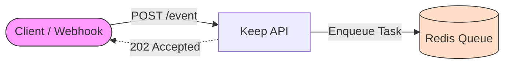
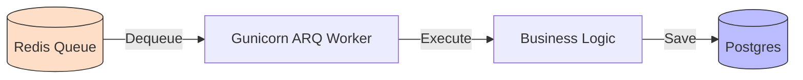
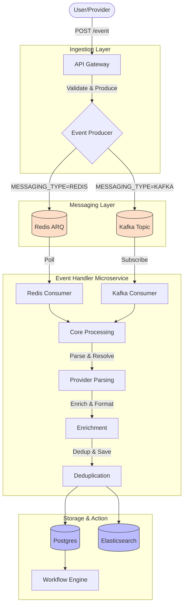
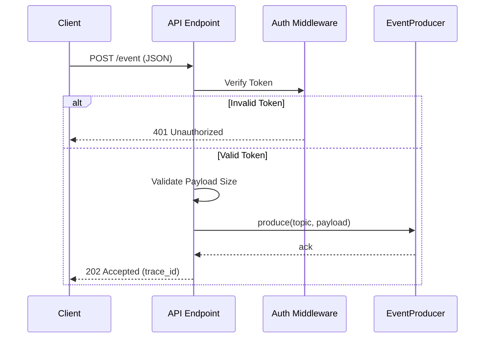
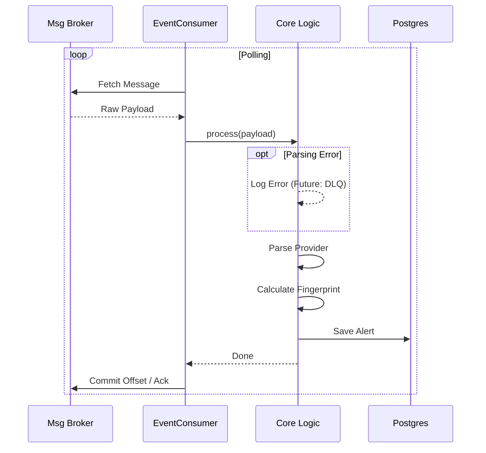

# Event Processing Architecture Specification

## 1. Introduction & Current Architecture

This document outlines the proposed architectural changes to the Keep event processing pipeline. The goal is to transition from a tightly coupled, Redis-dependent monolithic structure to a modular, microservice-based architecture that supports high-throughput messaging backends like Apache Kafka.

### 1.1 Legacy Architecture Overview
Currently, the event processing pipeline is embedded directly within the API service (`keep-backend`) and is strictly bound to Redis and ARQ (Async Redis Queue).

#### End-to-End Alert Flow (Legacy)
1.  **Ingestion**: An HTTP `POST` request is received at `/alerts/event/{provider_type}`.
2.  **Synchronous Processing**:
    *   **Authentication**: The request is authenticated.
    *   **Provider Resolution**: The API logic resolves the provider class based on the `provider_type`.
    *   **Parsing**: The API synchronously calls `provider.parse_event_raw_body(event)`. If the payload is large or complex, this blocks the API worker thread.
    *   **Formatting**: The parsed event is formatted into a standardized `AlertDto`.
3.  **Enqueuing**: The formatted alert is enqueued into Redis using the `keep_arq_pool`.
4.  **Consumption**: A background worker picks up the job from Redis.
5.  **Execution**: The worker executes the task (saving to DB, running workflows).

#### Legacy Event Loop
The worker execution model relies on a custom Gunicorn worker class (`arq_worker_gunicorn.py`).
*   **Mechanism**: The API container starts a Gunicorn server. One or more of these workers are dedicated to running `uvicorn` for the API, while others might be configured to run the ARQ worker loop.
*   **Startup**: The worker loop is initiated via a custom `Worker` class that overrides Gunicorn's `run()` method to start an asyncio loop for ARQ.
*   **Coupling**: This means the worker's lifecycle is tied to the API's deployment and scaling configuration. You cannot easily deploy "just workers" without the API code and overhead.





### 1.2 Limitations & Risks of Legacy Architecture

The legacy architecture (monolithic API + Worker coupled via Redis) presents significant risks at scale, primarily due to synchronous blocking and lack of isolation.

#### 1. The "Blocking" Problem (The Main Bottleneck)
In the legacy flow, the API performs **synchronous** work (parsing, provider resolution) *before* enqueuing the background job.
*   **The Mechanism**: When a `POST /event` request arrives, the API worker thread (Gunicorn/Uvicorn) executes parsing logic immediately.
*   **The Risk**: Python's GIL facilitates single-thread execution for CPU-bound tasks. If a payload is large (e.g., 10MB JSON) or requires complex regex, the API worker blocks for the duration (e.g., 2-3 seconds).
*   **The Impact**: With a limited pool of API workers (e.g., 4), concurrent large requests can freeze the entire ingestion layer, causing 503 errors and health check failures for unrelated traffic. "The Bad Event" scenario where a single malformed payload brings down the API is a direct consequence of this.

#### 2. Tightly Coupled Scaling (Resource Inefficiency)
The API logic and Worker logic often share the same deployment artifact and resources.
*   **Scalability Mismatch**: The **Ingestion** layer (IO-bound) and **Processing** layer (CPU-bound) have different scaling profiles.
*   **Inefficiency**: Scaling the API to handle high connection concurrency usually means redundant scaling of the processing logic/memory, or vice-versa. You cannot scale them independently.

#### 3. Failure Blast Radius (Lack of Isolation)
*   **The Scenario**: A bug in a specific provider's parser (e.g., catastrophic backtracking in a regex).
*   **Legacy Behavior**: This crashes the API worker handling the HTTP request. 
*   **Microservice Behavior**: The API accepts the bytes, acknowledges (202), and offloads. If the consumer crashes later, the API remains stable, and the message is preserved in the broker for retry or dead-letter queueing.

#### 4. Hard Dependency on Redis
*   **Rigidity**: The codebase is strictly coupled to `arq` and `Redis`.
*   **Evolution**: Supporting industry-standard streaming platforms like **Kafka** requires a fundamental abstraction which is absent in the legacy codebase. This prevents the adoption of high-throughput patterns like batch processing and persistent event logs.

## 2. The New Proposed Solution

We propose a refactor to split the event processing into a dedicated **Event Handler Microservice**.

### 2.1 Key Design Changes

1.  **Lightweight API Gateway**
    *   **Role**: The API will only validate request authentication and basic constraints (e.g. size limits) before offloading the *raw* event to the message broker.
    *   **Change**: All parsing, complicated provider resolution, and formatting logic moves to the worker.
    *   **Result**: The API acts as a dumb pipe, ensuring sub-millisecond response times regardless of payload complexity.

2.  **Pluggable Messaging Layer**
    *   **Abstraction**: Introduce `EventProducer` and `EventConsumer` interfaces to support switching between **Redis** (legacy) and **Kafka** (new).
    *   **Configuration**: A simple `MESSAGING_TYPE` env var will control the backend.
    
    #### Interface Templates
    
    ```python
    from abc import ABC, abstractmethod
    
    class EventProducer(ABC):
        @abstractmethod
        async def produce(self, topic: str, payload: dict, key: str = None):
            """Send a message to the broker."""
            pass
            
    class EventConsumer(ABC):
        @abstractmethod
        async def start(self):
            """Start the consumer loop."""
            pass
            
        @abstractmethod
        async def stop(self):
            """Stop the consumer loop."""
            pass
    ```

3.  **Dedicated Event Handler Service**
    *   **Service**: A new `keep-event-handler` service running as a standalone FastAPI application.
    *   **Monorepo Strategy**: For the initial implementation, this service will reside within the current monorepo (e.g., under `keep/event_handler`) rather than a separate repository. This simplifies dependency management and shared code usage during the refactor.

4.  **Modern Lifecycle Management**
    *   **Lifecycle**: The new service uses FastAPI's `lifespan` context manager to handle startup and shutdown.
    *   **Why is this better?**: 
        *   **Standardization**: Gunicorn custom workers are a "hacky" way to run async loops and are hard to debug/instrument. FastAPI `lifespan` is the official, supported way to manage startup/shutdown events in modern ASGI apps.
        *   **Control**: It gives us explicit hooks for `await consumer.start()` and `await consumer.stop()`, ensuring clean connection draining and proper resource cleanup, which is notoriously difficult with Gunicorn worker signals.
        *   **Observability**: It allows us to initialize OpenTelemetry/Prometheus exporters *once* at app startup, rather than per-worker-fork.

### 2.2 Functional Separation

#### Legacy Functional Responsibilities (Current State)
Before separation, the **API Service** handles a mix of concerns:
*   **Ingestion**: Receives HTTP `POST`.
*   **Parsing**: Runs provider logic (CPU heavy).
*   **Enqueuing**: Pushes to Redis.
*   **Worker Execution**: Runs background tasks (in the same container/image).

In the new architecture, we strictly separate these concerns as follows:

#### API Gateway Responsibilities (Ingestion)
The API is strictly an entry point.
*   **Auth**: Validate API Key / JWT.
*   **Validation**: Check Payload Size < Limit.
*   **Produce**: Serialize raw JSON -> Byte Array -> Broker.
*   **Response**: Return `202 Accepted` + `trace_id`.

#### Worker Responsibilities (Event Handler)
The Worker is the brain.
*   **Consume**: Poll/Subscribe to Broker.
*   **Parse**: `provider.parse_event_raw_body(bytes)`.
*   **Enrich**: Run Enrichment Rules (Topology, Mapping).
*   **Deduplicate**: Check Fingerprint signature.
*   **Persist**: Save to DB / Elastic.
*   **Trigger**: Evaluate Workflows.

### 2.3 Future Work: Error Handling (DLQ)
*Note: For the initial refactor, we will log errors to stdout. A robust Dead Letter Queue (DLQ) system for parsing failures is planned for Phase 2.*

## 3. Architecture Diagrams

### 3.1 Proposed Architecture (High Level)



### 3.2 Detailed Flow: API Gateway



### 3.3 Detailed Flow: Event Handler Worker



## 4. Summarization

This architecture overhaul will transform Keep from a monolithic application into a scalable event processing platform. By decoupling the API from the worker and introducing the `EventProducer`/`EventConsumer` abstraction, the system will support high-throughput ingestion via Kafka while maintaining backward compatibility with Redis. This design facilitates independent scaling, improved resilience, and flexible infrastructure choices.
