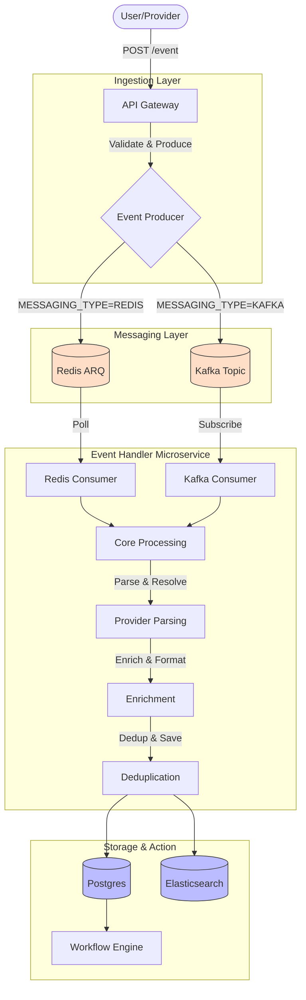

# Event Processing Architecture

## 1. Introduction

This document outlines the current architecture of the Keep event processing pipeline. The system uses a modular, microservice-based architecture to decouple ingestion from processing, supporting high-throughput messaging backends like **Apache Kafka** while maintaining support for **Redis** (ARQ).

### 1.1 High-Level Overview

The architecture consists of three main components:
1.  **API Gateway (Ingestion)**: Lightweight entry point that validates requests and offloads raw events to a message broker.
2.  **Messaging Layer**: Pluggable abstraction (`EventProducer`/`EventConsumer`) supporting Redis and Kafka.
3.  **Event Handler Service (Worker)**: Dedicated service that consumes events, runs business logic (parsing, enrichment, workflows), and persists data.


```mermaid
flowchart TD
    User([User/Provider]) -->|POST /event| API[API Gateway]
    
    subgraph "Ingestion Layer"
        API -->|Validate & Produce| Producer{Event Producer}
    end

    subgraph "Messaging Layer"
        Producer -->|MESSAGING_TYPE=REDIS| RedisQueue[(Redis ARQ)]
        Producer -->|MESSAGING_TYPE=KAFKA| KafkaTopic[(Kafka Topic)]
    end

    subgraph "Event Handler Microservice"
        RedisQueue -->|Poll| RedisWorker[Redis Consumer]
        KafkaTopic -->|Subscribe| KafkaConsumer[Kafka Consumer]
        
        RedisWorker --> Core[Core Processing]
        KafkaConsumer --> Core
        
        Core -->|Parse & Resolve| Parser[Provider Parsing]
        Parser -->|Enrich & Format| Enricher[Enrichment]
        Enricher -->|Dedup & Save| Deduplicator[Deduplication]
    end

    subgraph "Storage & Action"
        Deduplicator --> DB[(Postgres)]
        Deduplicator --> Elastic[(Elasticsearch)]
        DB --> Workflows[Workflow Engine]
    end

    style RedisQueue fill:#ffdec7,stroke:#333
    style KafkaTopic fill:#ffdec7,stroke:#333
    style DB fill:#bbf,stroke:#333
    style Elastic fill:#bbf,stroke:#333
```

## 2. Key Components & Implementation

### 2.1 API Gateway (Ingestion)

The API (**`keep-api`**) acts as a dumb pipe. It does *not* parse or process events synchronously. Its responsibilities are strict:
*   Authentication (API Key / JWT)
*   Basic Size Validation
*   Producing to the Message Broker

**Key File**: [`keep/api/routes/alerts.py`](file:///Users/yarin/keep/keep/api/routes/alerts.py)

**Code Example**:
The `receive_event` endpoint extracts the raw body and uses the `event_producer` dependency to offload it immediately.

```python
# keep/api/routes/alerts.py

async def receive_event(
    provider_type: str,
    request: Request,
    # ... dependencies
    event_producer: EventProducer = Depends(get_event_producer),
) -> dict[str, str]:
    # Use the abstract event producer (Redis or Kafka)
    task_name = await event_producer.produce(
        event=event,
        tenant_id=authenticated_entity.tenant_id,
        provider_type=provider_type,
        # ... other metadata
    )
    return JSONResponse(content={"task_name": task_name}, status_code=202)
```

### 2.2 Messaging Abstraction

The system relies on an abstraction layer to support multiple backends. This allows Keep to run in "lightweight" mode (Redis) or "scale" mode (Kafka) using the same core logic.

**Key File**: [`keep/common/core/messaging.py`](file:///Users/yarin/keep/keep/common/core/messaging.py)

The `EventProducer` interface defines the contract:

```python
# keep/common/core/messaging.py

class EventProducer(abc.ABC):
    @abc.abstractmethod
    async def produce(self, event: dict, **kwargs):
        pass

class KafkaEventProducer(EventProducer):
    async def produce(self, event: dict, **kwargs):
        # ... implementation using aiokafka ...
```

### 2.3 Event Handler Service (Processing)

The Worker (**`keep-event-handler`**) is the brain of the operation. It runs independently from the API and consumes messages from the configured broker.

**Responsibilities**:
1.  **Consumption**: Loop that polls Redis or subscribes to Kafka topics.
2.  **Parsing**: Converts raw bytes -> Provider-specific Object -> Standard `AlertDto`.
3.  **Enrichment**: Applies mapping rules, topology, and property extraction.
4.  **Deduplication**: Calculates fingerprint and handles duplicate suppression.
5.  **Persistence**: Saves to Postgres and Elasticsearch.
6.  **Workflows**: Triggers automation workflows based on conditions.

**Key Files**:
*   **Consumer Logic**: [`keep/event_handler/core/kafka_consumer.py`](file:///Users/yarin/keep/keep/event_handler/core/kafka_consumer.py)
*   **Core Processing**: [`keep/common/event_management/process_event_task.py`](file:///Users/yarin/keep/keep/common/event_management/process_event_task.py)

**Code Example (Consumer)**:
The consumer listens for messages and delegates to the core processing logic.

```python
# keep/event_handler/core/kafka_consumer.py

async def _consume_loop(self):
    async for msg in self.consumer:
        # Deserialize
        payload = json.loads(msg.value.decode("utf-8"))
        
        # Process with retries
        await process_event_wrapper(ctx={}, event_dto=event_dto)
        
        # Commit offset
        await self.consumer.commit()
```

**Code Example (Core Logic)**:
This function contains the bulk of the business logic.

```python
# keep/common/event_management/process_event_task.py

def process_event(
    ctx: dict,
    tenant_id: str,
    event: AlertDto | dict,
    # ... args
) -> list[Alert]:
    # 1. Parsing (if raw dict)
    # 2. Preparation & Normalization
    # 3. Deduplication (AlertDeduplicator)
    # 4. Save to DB (__save_to_db)
    # 5. Workflow Execution (WorkflowManager)
    # 6. Rules Engine (Correlation)
```

## 3. Developer Onboarding: Quick Reference

Use this table to locate the code relevant to each stage of the pipeline.

| Component | Functionality | Key File Location |
| :--- | :--- | :--- |
| **Ingestion** | API Endpoint Definition | [`keep/api/routes/alerts.py`](file:///Users/yarin/keep/keep/api/routes/alerts.py) |
| **Abstractions** | Producer Interfaces | [`keep/common/core/messaging.py`](file:///Users/yarin/keep/keep/common/core/messaging.py) |
| **Consumer** | Kafka Consumer Loop | [`keep/event_handler/core/kafka_consumer.py`](file:///Users/yarin/keep/keep/event_handler/core/kafka_consumer.py) |
| **Core Logic** | Parsing, Saving, Workflows | [`keep/common/event_management/process_event_task.py`](file:///Users/yarin/keep/keep/common/event_management/process_event_task.py) |
| **Logic** | Deduplication Rules | [`keep/common/alert_deduplicator/alert_deduplicator.py`](file:///Users/yarin/keep/keep/common/alert_deduplicator/alert_deduplicator.py) |
| **Logic** | Workflow Triggering | [`keep/workflowmanager/workflowmanager.py`](file:///Users/yarin/keep/keep/workflowmanager/workflowmanager.py) |

## 4. Legacy Architecture (Reference)

*Note: This describes the system prior to the separation of concerns. It is kept here for historical context.*

The legacy architecture was a monolithic design where the API worker thread performed synchronous parsing and provider resolution before enqueuing a job to Redis.
*   **Blocking**: Large payloads could block the API thread during parsing.
*   **Coupling**: Worker logic and API logic shared the same deployment lifecycle.
*   **Redis-Only**: Hard dependency on Redis preventing high-throughput event streaming.

The current architecture resolves these issues by offloading the "heavy lifting" to the asynchronous worker layer.
