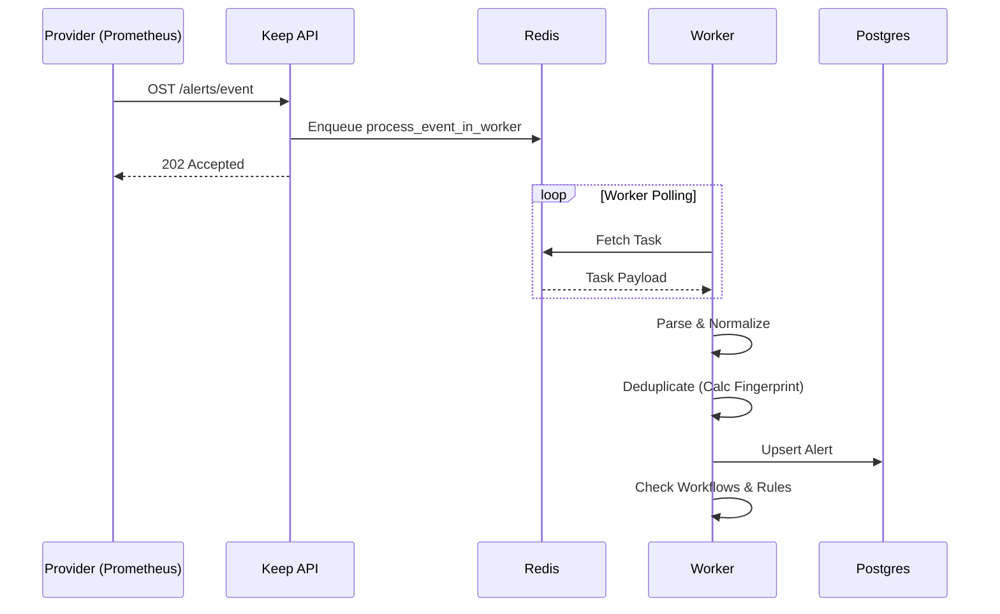
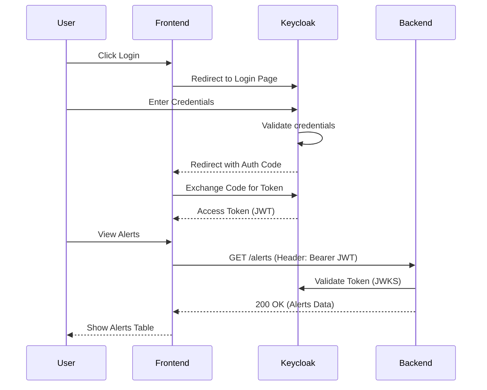

## Story 1: Alert Ingestion

```mermaid
sequenceDiagram
    participant P as Provider (Prometheus)
    participant API as Keep API
    participant R as Redis
    participant W as Worker
    participant DB as Postgres

    P->>API: OST /alerts/event
    API->>R: Enqueue process_event_in_worker
    API-->>P: 202 Accepted
    
    loop Worker Polling
        W->>R: Fetch Task
        R-->>W: Task Payload
    end
    
    W->>W: Parse & Normalize
    W->>W: Deduplicate (Calc Fingerprint)
    W->>DB: Upsert Alert
    W->>W: Check Workflows & Rules
```

## Story 2: User Login (Keycloak)

```mermaid
sequenceDiagram
    participant U as User
    participant FE as Frontend
    participant KC as Keycloak
    participant BE as Backend

    U->>FE: Click Login
    FE->>KC: Redirect to Login Page
    U->>KC: Enter Credentials
    KC->>KC: Validate credentials
    KC-->>FE: Redirect with Auth Code
    FE->>KC: Exchange Code for Token
    KC-->>FE: Access Token (JWT)
    
    U->>FE: View Alerts
    FE->>BE: GET /alerts (Header: Bearer JWT)
    BE->>KC: Validate Token (JWKS)
    BE-->>FE: 200 OK (Alerts Data)
    FE-->>U: Show Alerts Table
```
